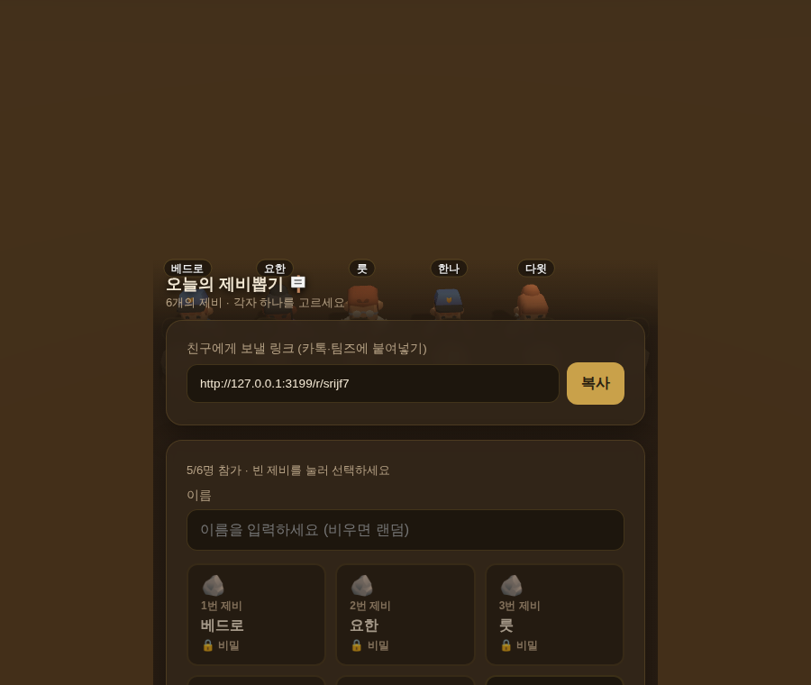
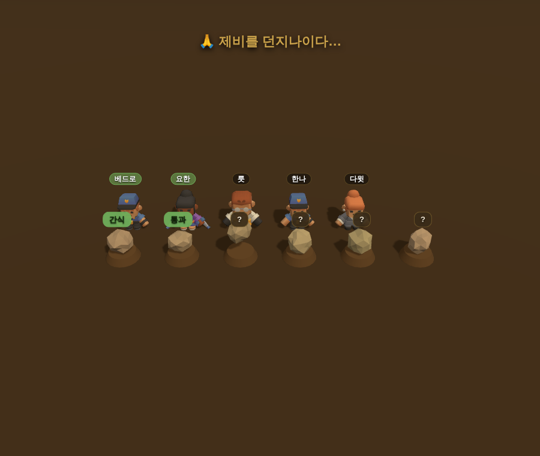

# 🪧 성경의 제비뽑기 (Casting Lots Online)

여러 사람이 함께 즐기는 **온라인 제비뽑기**. 방을 만들어 링크를 카톡·팀즈로
공유하면, 각자 제비(돌)를 직접 고르고, 방장이 시작하면 결과가 무작위 순열로
제비에 배정됩니다. **3D 캐릭터가 제비를 던져** 결과가 드러나는 순간을 함께
지켜봅니다.

> “제비는 사람이 뽑으나 모든 일을 작정하기는 여호와께 있느니라” — **잠언 16:33**
>
> 고대 이스라엘에서 하나님의 뜻을 묻던 제비뽑기에서 모티프를 가져왔습니다
> (맛디아 선출 · 행 1:26, 가나안 땅 분배 · 민 26:55, 요나 · 욘 1:7).




## 무료 배포 (Render)

[](https://render.com/deploy?repo=https://github.com/jungrok5/castinglots-online)

위 버튼 → Render 로그인 → **Apply** 한 번이면 배포됩니다. `render.yaml`에
빌드/시작 명령이 정의돼 있어 추가 설정이 필요 없습니다.

> 무료(Free) 인스턴스는 15분간 접속이 없으면 잠들고, 첫 접속 시 약 30초
> 콜드스타트가 있습니다. 게임 중에는 폴링으로 계속 깨어 있어 문제없습니다.

## 특징

- **데이터베이스 없음** — 모든 방 상태는 서버 메모리에 저장(잠깐 즐기는 용도, 12시간 후 자동 삭제).
- **의존성 없음** — Node 내장 `http` 모듈만 사용. `node server.js` 로 바로 실행.
- **실시간 동기화** — WebSocket 대신 1.5초 폴링으로 모든 참가자 화면을 맞춤.
- **3D 연출** — Three.js + Kenney Mini Characters. WebGL 실패 시 자동으로 **2D 연출로 폴백**.
- **공정한 배정** — 결과는 암호학적 Fisher–Yates 셔플로 만든 **무작위 순열**(전단사)이라 모든 결과가 정확히 한 번씩 배정됨.
- **결과 숨김** — 기본적으로 제비를 던지기 전까지 결과를 비밀로 둡니다(제비뽑기의 묘미).

## 게임 흐름

1. 방장이 **제비 수(2~12)** 와 각 제비에 숨길 **결과(자유 입력)** 를 정해 방을 만든다.
2. 링크를 공유 → 참가자들이 **원하는 제비를 직접 선택**한다.
3. 방장이 시작하면 결과가 무작위 순열로 배정되고, 캐릭터들이 제비를 던져 결과를 공개한다.
4. 방장은 **다시 뽑기**로 같은 멤버·같은 제비에 새 결과를 굴릴 수 있다.

## 사다리타기(ladder-online)와의 관계

같은 무DB·인메모리·폴링·zero-dep 아키텍처와 3D 무대를 공유합니다. 차이는
사다리 생성·경로추적(`buildLadder`/`tracePath`/`computeMapping`) 대신 결과 배정을
**무작위 순열 한 함수(`buildMapping`)** 로 처리한다는 점, 그리고 연출이 사다리
하강이 아니라 **제비 던지기**라는 점입니다.

## 시작하기

```bash
npm start        # http://localhost:3000
```

환경 변수 `PORT` 로 포트를 바꿀 수 있습니다.

## 테스트

```bash
npm test         # 로직/HTTP 통합 테스트 (의존성 없음, Node 18+ 전역 fetch)
```

3D 무대 스모크(스크린샷 캡처)는 Playwright가 필요합니다(선택):

```bash
npm i playwright
PLAYWRIGHT_BROWSERS_PATH=/opt/pw-browsers node test/smoke.mjs   # docs/*.png 생성
```

## 구조

| 파일 | 설명 |
| --- | --- |
| `server.js` | 순수 Node HTTP 서버 — 라우팅·정적 서빙(gzip·캐시·MIME)·인메모리 룸 저장소·결과 배정(`buildMapping`) |
| `public/index.html` | 방 생성 페이지 (제비 수·결과 입력) |
| `public/room.html` | 폴링 SPA — 로비(제비 선택)·연출 트리거·결과·2D 폴백 |
| `public/scene.js` | 3D 무대 (Three.js, 캐릭터 로딩·카메라 자동 프레이밍·제비 던지기 애니메이션) |
| `public/style.css` | 스타일 (어스톤 + 금빛 팔레트) |
| `public/vendor/`, `public/assets/` | Three.js 모듈, Kenney 캐릭터 GLB (장기 캐시) |

## API

| 메서드 · 경로 | 설명 |
| --- | --- |
| `POST /api/rooms` | 방 생성 `{ title, lotCount, results[], drawMode, resultsHidden }` → `{ roomId, hostToken }` |
| `GET /api/rooms/:id` | 공개 상태. **시작 전에는 매핑(과 숨긴 결과)을 노출하지 않음** |
| `POST /api/rooms/:id/join` | 참가 `{ name, lot? }` (pick: 제비 지정/자동, 점유 시 409) |
| `POST /api/rooms/:id/start` | 시작 `{ hostToken }` — 결과 순열 배정, `revealing` 전이 |
| `POST /api/rooms/:id/finish` | 연출 종료 표시(멱등) — `finished` 전이 |
| `POST /api/rooms/:id/reset` | 로비로 복귀 `{ hostToken }` (pick 제비 유지) |

## 배포

`render.yaml` 로 Render 무료 플랜에 배포됩니다(`node server.js`, `autoDeploy`).

## 라이선스

MIT. 캐릭터 모델은 [Kenney Mini Characters](https://kenney.nl) (CC0) —
`public/assets/characters/LICENSE.txt` 참고.
